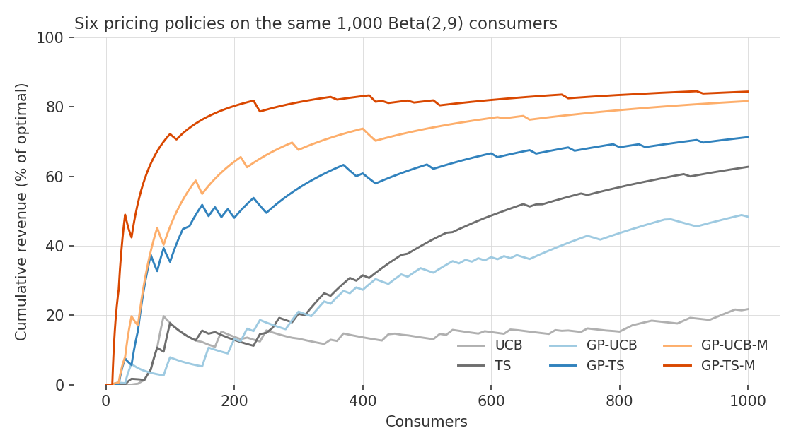

# pricingbandits

Multi-armed bandit approaches to pricing experiments with an unknown demand
curve — the Python port of the
[PricingBandits](https://github.com/ian-weaver/PricingBandits) R package, from:

> Weaver, I. N., Kumar, V., & Jain, L. *Nonparametric Pricing Bandits Leveraging
> Informational Externalities to Learn the Demand Curve*. Marketing Science.

Dependencies: **numpy** and **scipy** only. The truncated multivariate-normal
sampler (Botev's minimax exponential tilting, as in the R package
`TruncatedNormal`) is included, self-contained.

> Looking for the **R version** (on CRAN)? See
> [PricingBandits](https://github.com/ian-weaver/PricingBandits).

## Installation

```bash
pip install pricingbandits
# or from source:
pip install -e .
```

## Quick start

You supply one consumer valuation (willingness to pay) per round — drawn from
*any* distribution you like — plus a set of candidate prices. The chosen policy
prices each arriving consumer and learns from buy/no-buy feedback alone.

```python
import numpy as np
import pricingbandits as pb

rng = np.random.default_rng(1)
valuations = rng.beta(2, 9, 2500)        # any WTP process you like

out = pb.pricing_bandit(valuations,
                        prices=np.arange(1, 11) / 10,
                        policy="GP-TS-M",
                        batch_size=10,
                        rng=rng)

print(np.unique(out.prices_tested, return_counts=True))
print(out.diagnostics)
```

## Policies

| Name | Description |
|------|-------------|
| `"UCB"` | Upper Confidence Bound on independent arms |
| `"TS"` | Thompson Sampling with Beta posteriors per arm |
| `"GP-UCB"`, `"GP-TS"` | Gaussian-process variants — arms correlated through a GP demand curve (first informational externality) |
| `"GP-UCB-M"`, `"GP-TS-M"` | Monotonic variants — demand draws weakly decreasing everywhere by construction (second informational externality) |

Options: `hetero=True` enables the heterogeneous-noise extension for GP
variants; `reset=n` wipes the history every `n` consumers; `num_knots` controls
the monotonic variants' constraint grid and defaults to 11 regardless of the
number of arms; `timeout` (default 5s) bounds each truncated-sampling attempt
before the fallback chain advances.

## Policy Comparison Example

Running each policy with one seed on the same 1,000 consumers — willingness
to pay drawn from a Beta(2, 9) distribution — gives the results below. To
compare policies, score each price the bandit posted by its expected revenue
under the true distribution, and track the cumulative total as a percentage
of what always charging the optimal price would have earned:

```python
from scipy.stats import beta as beta_dist

expected_revenue = prices * (1 - beta_dist.cdf(prices, 2, 9))
grid = np.arange(1, 1_000_001) / 1_000_000
optimal = np.max(grid * (1 - beta_dist.cdf(grid, 2, 9)))  # best any price could do

def score(out):
    earned = expected_revenue[np.searchsorted(prices, out.prices_tested)]
    return np.cumsum(earned) / (np.arange(1, len(earned) + 1) * optimal) * 100

curves = {}
for policy in ["UCB", "TS", "GP-UCB", "GP-TS", "GP-UCB-M", "GP-TS-M"]:
    out = pb.pricing_bandit(valuations, prices, policy=policy, batch_size=10,
                            rng=np.random.default_rng(1))
    curves[policy] = score(out)   # one line per policy in the figure below
```

<picture>
  <source media="(prefers-color-scheme: dark)" srcset="assets/README-comparison-dark.png">
  
</picture>

See [examples/quickstart.py](examples/quickstart.py) for the full runnable
version, including the heterogeneous-noise variants.

## Fidelity to the R package

- Deterministic components (kernels, basis functions, aggregation, likelihood,
  GP posterior) match R to ~1e-10 (golden tests in `tests/`).
- UCB trajectories are bit-identical to R given the same valuations.
- Stochastic policies are validated statistically: mean cumulative % of optimal
  reward matches the R implementation within Monte-Carlo error across the
  paper's simulation settings.
- Intentional deviations: hyperparameters are optimized with L-BFGS-B rather
  than COBYLA (scipy's COBYLA is prohibitively slow; both find the same optimum
  from the same start in >99% of encountered datasets), and cross-language RNG
  streams necessarily differ.

Every run also returns lightweight ``diagnostics`` counting how often the
numerical fallback paths fired (hyperparameter-optimization failures,
truncated-sampler timeouts, last-resort samplers) - in normal operation these
are all zero.
